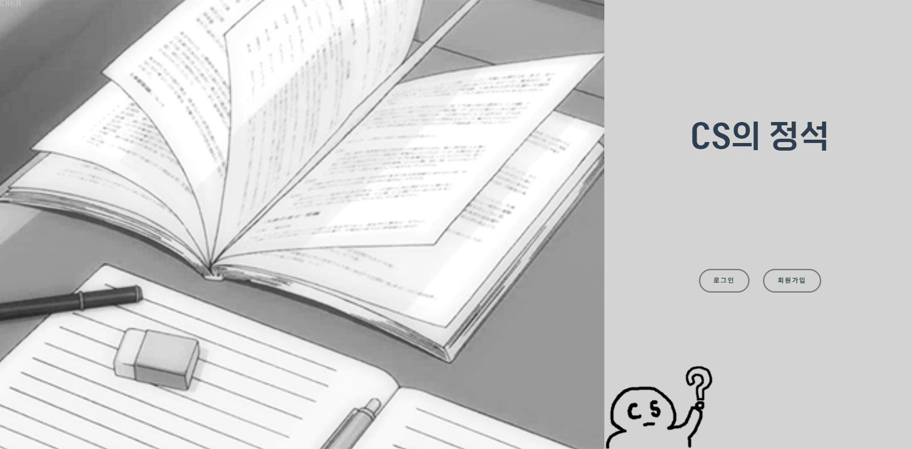

 
 

 

 
 

 
 
 
 
 
 

 

## 👨‍👩‍👦팀원 소개

**박지수 서정욱 이조순 진해진**

- 🐣Github: [@PARK JI SU](https://github.com/jisup)
- 🦝Github: [@SEO JEONG UK](https://github.com/Seojeonguk)
- 🌰Github: [@LEE JO SUN](https://github.com/KingBlackCow)
- 🐣Github: [@JIN HAE JIN](https://github.com/HAEJINN)

## 📆 프로젝트 개요

- 진행 기간 : 2021.10.11 ~ 2021.11.19

- 서비스명 : CS의 정석
- 목표 : Computer Science 역량 향상을 위한 음성 인식 퀴즈 웹 서비스

  - 퀴즈 형태로 나오는 CS지식을 음성인식을 통해 말하면서 학습할 수 있다.
  - 결과 그래프를 통해 자신이 부족한 부분을 확인하여 집중적으로 학습할 수 있다.
  - 이전 자신의 데이터와 비교하여 실력을 분석할 수 있다.
  - 게시판을 제작하여 사용자들끼리 의견을 공유할 수 있다.

- [커뮤니케이션][@notion](https://www.notion.so/invite/2a06daf8c238e1101ca338a241b4fb14c5752f19)
- [와이어프레임][@wire frame](https://framer.com/projects/cs--qxjc9e432DFiUf7FBgcR-3BK0I?node=PaTegxmm0-page)
- [ERD]
- [API][@web speech api](https://developer.mozilla.org/en-US/docs/Web/API/Web_Speech_API)
- [API_SUB][@toast ui editor](https://ui.toast.com/tui-editor)

 

## ✍ 프로젝트 소개

CS의 정석은 개발자들의 Computer Science 역량을 강화하기 위해 개발하였습니다. 
각종 부트캠프들로 가운데 신입 개발자들의 코딩 실력과 개발 실력이 높아지고 있지만, 
Computer Science를 제대로 공부하지 못하여 기술면접에 어려움을 겪는 개발자들이 많습니다. 
저희는 책과 블로그로만 익히는 Computer Science 지식을 더욱 능동적으로 학습하여 학습의 효율을 올리고  
이를 음성 인식을 통해 답을 인식하는 Computer Science 퀴즈 웹서비스를 제안하고자 합니다.

## ⭐️주요 기능

### 음성인식 서비스

> Web Speech API를 활용한 음성인식

- 
- Web speech api를 통해 사용자의 음성을 입력받습니다.
- 음성을 text로 변환한뒤 이를 분석하여 답을 추출합니다.

- 
- 문제의 결과를 언급된 단어, 비언급 단어로 분류하여 추출합니다.
- 언급단어 1/3 이상 시 정답처리합니다.

- 
- 이전 자신의 기록과 비교하여 자신의 기록을 분석할 수 있습니다.
- 과목별 기록을 제공하여 과목별로 기록을 분석할 수 있습니다.

### 게시판 서비스

> Toast UI Editor를 활용한 게시판

- 
- 글작성 시 개발자에게 친숙한 MarkDown 및 HTML 작성 환경 제공

 

## ❔ 서비스 아키텍쳐

## 🎞 최종산출물

- [시연 영상](https://youtu.be/qct8XHwHFrs)

- [PDF]

## 😋 Installation

### ✨Front-End

- **지원 환경** : Web
- **담당자** : 박지수, 진해진
- **⚙ 기술스택**
  - HTML, JS, CSS
  - SCSS
  - Vue.js @3.6.11
- 라이브러리
  - axios
  - vuex
  - vuex-persistedstate
  - node-sass
  - quasar
  - vuejs-countdown
  - vuelendar
  - vuelidate
  - aos
  - jwt-decode
  - less-loader
  - sass-loader
  - ant-design-vue
  - @fortawesome/fontawesome-svg-core
  - @fortawesome/free-regular-svg-icons

### 💻Back-End

- **담당자** : 서정욱, 이조순
- **⚙기술스택**
  - Java
  - SpringBoot
  - Spring Data JPA
  - Spring Security
  - SMTP
  - JWT
  - SWAGGER
  - Jenkins
  - MySQL
  - Redis
  - Nginx
  - AWS
    - EC2
    - S3
